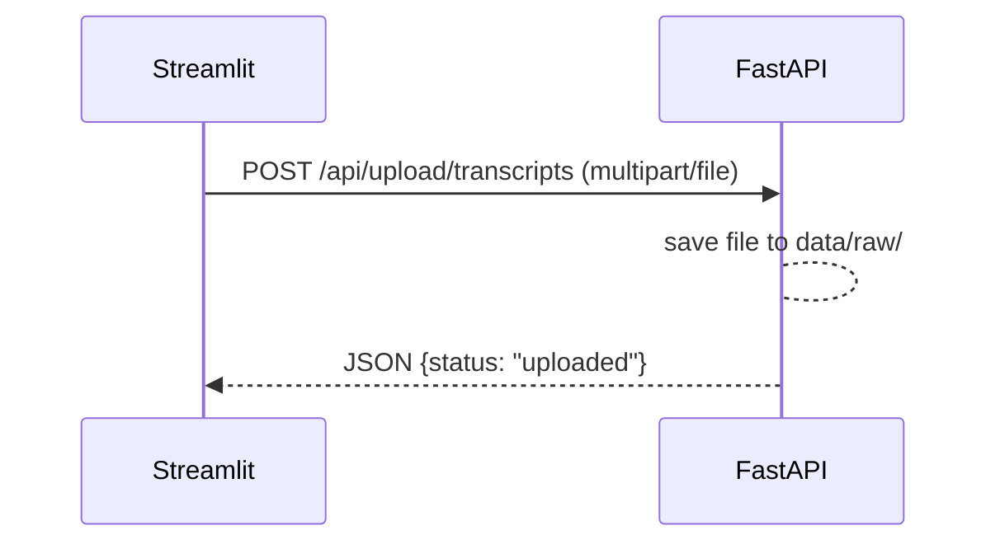
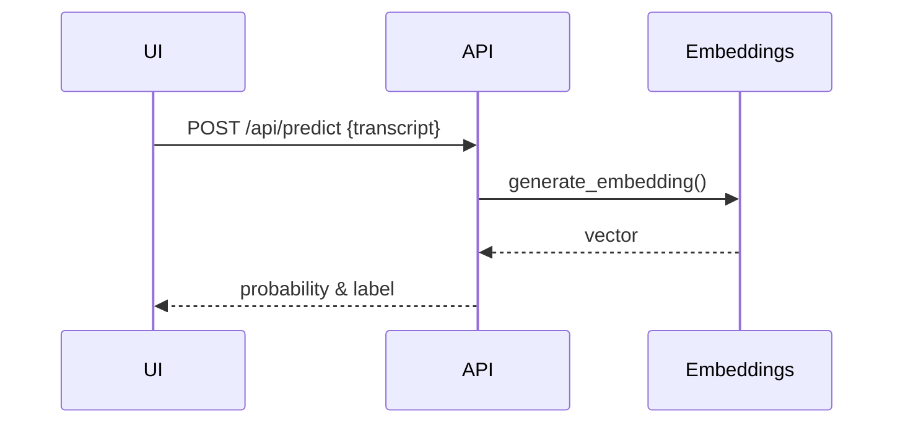
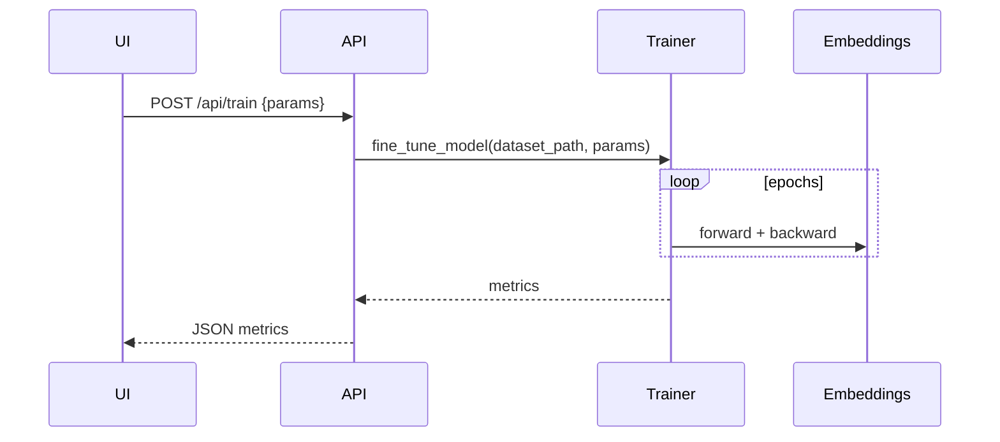

# Application Flow

This document explains what happens under the hood when you start the project and interact with the UI.

---

## 1. Startup (`run_all.py`)

```mermaid
flowchart TD
    A[run_all.py] --> B{CLI Flags}
    B --win/linux--> C[Activate venv (if needed)]
    C --> D[Start FastAPI (run_api.py)]
    C --> E[Start Streamlit (app/main.py)]
```

* `run_all.py` accepts `--win | --linux`, port flags, and `--no-venv`.
* It activates `.venv` unless already active.
* Launches:
  * FastAPI backend on `API_PORT` (default **8000**) via `run_api.py`.
  * Streamlit front-end on `STREAMLIT_PORT` (default **8501**).
* Sets environment variables so the two services know how to talk to each other.

---

## 2. User uploads transcript (UI ➜ API)

```
Streamlit Button → /api/upload/transcripts → api.routes.upload_transcripts → storage.save_file
```



---

## 3. Prediction flow

```
UI text box → /api/predict → embeddings.inference.predict_transcript
```



---

## 4. Training flow ("Start Training" button)

```
UI ➜ /api/train ➜ training.pipeline.fine_tune
```



---

## 5. Metrics & Comparison

* **/api/metrics** – returns validation/performance stats.
* **/api/compare** – compares generic vs fine-tuned embeddings.

---

## Endpoint Summary

| Endpoint | Purpose |
|----------|---------|
| `POST /api/upload/transcripts` | Upload raw transcript file |
| `POST /api/predict` | Predict conversion probability |
| `POST /api/train` | Fine-tune embedding model |
| `GET /api/metrics` | Retrieve training metrics |
| `GET /api/compare` | Compare generic vs fine-tuned models |

> All endpoints live in `api/main.py` and delegate to the relevant service modules in `src/`.
